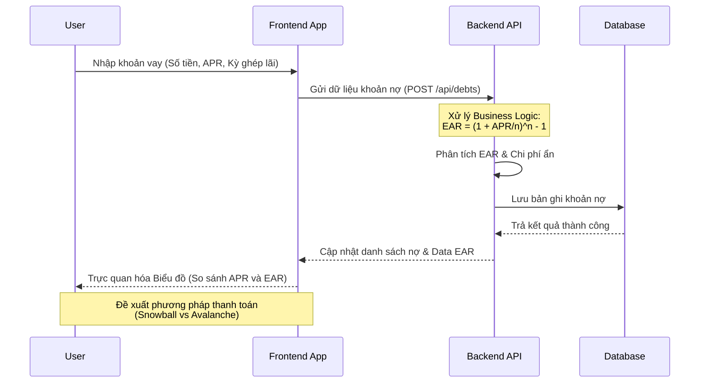

# FinSight - AI Financial Advisor

> **Dự án tham gia cuộc thi WebDev Adventure 2026 (WDA2026)**
> 
> **Chủ đề:** Quản lý tài chính cá nhân.

## 1. Tổng quan dự án (Project Overview)
**FinSight** là một nền tảng Web Application thông minh hỗ trợ quản lý tài chính cá nhân. Ứng dụng được thiết kế nhằm giúp người dùng theo dõi tài sản, tối ưu hóa các khoản nợ, hiểu rõ các chi phí ẩn (hidden costs) qua việc phân tích **EAR (Effective Annual Rate)** so với **APR (Annual Percentage Rate)**, và tự động vạch ra chiến lược trả nợ (Repayment Strategy) hiệu quả (như phương pháp Snowball hoặc Avalanche). Bên cạnh đó, hệ thống cung cấp các công cụ **Risk Assessment** (đánh giá rủi ro) và theo dõi **Investment Portfolio** (danh mục đầu tư).

Dự án này được xây dựng bám sát yêu cầu vòng 2 của cuộc thi WDA2026, cung cấp đầy đủ Source Code, UI/UX được thiết kế riêng (không dùng template có sẵn hay tool no-code), và đáp ứng hoàn thiện các luồng nghiệp vụ (business flows) để đem đi trình bày (pitching) tại vòng Chung kết.

## 2. Kiến thức tài chính (Financial Concepts) áp dụng
Để xây dựng logic cốt lõi cho ứng dụng, các kiến thức chuyên ngành Tài chính (Finance) sau đã được sử dụng:
- **APR (Annual Percentage Rate)**: Lãi suất danh nghĩa hàng năm (thường được quảng cáo bởi các tổ chức tín dụng).
- **EAR (Effective Annual Rate)**: Lãi suất thực tế sau khi tính toán tác động của lãi kép (compounding). Việc hiển thị EAR giúp người dùng nhận ra chi phí vay vốn thực sự so với APR bề mặt.
- **Debt Repayment Strategies (Chiến lược trả nợ)**:
  - **Snowball Strategy**: Trả nợ từ khoản có dư nợ nhỏ nhất để tạo động lực tâm lý (quick wins).
  - **Avalanche Strategy**: Xếp ưu tiên thanh toán các khoản có mức lãi suất (Interest Rate) cao nhất để tối ưu chi phí lãi vay (Interest Expense) trong dài hạn.
- **Risk Assessment**: Khảo sát và đánh giá khẩu vị rủi ro (Risk Tolerance) của người dùng để đề xuất chiến lược đầu tư phù hợp.
- **Asset Allocation**: Phân bổ tài sản vào các loại hình khác nhau (Ví dụ: Cash, Equities, Bonds) để đa dạng hóa rủi ro.

## 3. Danh sách Chức năng (Features List)

| STT | Tên chức năng | Mô tả ngắn | Tình trạng |
|---|---|---|---|
| 1 | **Authentication** | Đăng ký, Đăng nhập, Quản lý phiên làm việc của người dùng (Session). | Đã hoàn thành |
| 2 | **Dashboard Overview** | Dashboard hiển thị tổng quan tài chính (Net Worth, Total Debt), biểu đồ phân bổ tài sản và các Insights được AI tạo. | Đã hoàn thành |
| 3 | **Debt Management** | Quản lý chuyên sâu các khoản nợ (Debts): thêm, sửa, xóa thông tin chi tiết các khoản vay tín dụng. Cảnh báo nợ đáo hạn. | Đã hoàn thành |
| 4 | **EAR Analysis** | Công cụ so sánh trực quan APR vs EAR, phân tích sự thay đổi trong kỳ ghép lãi (Compounding frequency) ảnh hưởng đến số tiền thực trả. | Đã hoàn thành |
| 5 | **Repayment Planner** | Đưa ra Kế hoạch trả nợ tự động (Roadmap) dựa trên tình hình tài chính hiện tại bằng thuật toán Snowball/Avalanche. | Đã hoàn thành |
| 6 | **Investment & Risk** | Công cụ đánh giá điểm rủi ro (*Risk Score*) và theo dõi lợi nhuận danh mục (*Investment Portfolio*). | Đã hoàn thành |
| 7 | **Dark/Light Mode** | UI/UX chuyên nghiệp mang âm hưởng các ứng dụng SaaS và VSCode, hỗ trợ Theme chuyển đổi linh hoạt bằng *CSS Variables*. | Đã hoàn thành |

## 4. Công nghệ sử dụng (Tech Stack)
Tuân thủ quy định của đề thi (Không sử dụng WordPress, Wix, Webflow, Streamlit, v.v.), hệ thống được xây dựng từ đầu 100% bằng code:
- **Frontend**: React.js (khởi tạo qua Vite), Tailwind CSS để styling, Framer Motion (cho UI Animations mượt mà), React Router DOM, Vite hmr.
- **Backend**: Node.js, Express.js (RESTful APIs).
- **Database**: MongoDB và Mongoose ORM.
- **Biểu đồ (Charts)**: Recharts (Hiển thị dữ liệu tương tác).

## 5. Sơ đồ hệ thống & Luồng hoạt động (System Diagrams)

### 5.1. Sơ đồ Kiến trúc Tổng quan (Architecture Diagram)
```mermaid
graph TD
    Client[Client Browser (React/Vite)] <-->|HTTP/REST APIs| Server[Node.js Express Server]
    Server <--> Database[(MongoDB)]
    
    subgraph "Frontend Architecture"
        UI[UI Components & Layout]
        Router[React Router]
        State[State (Auth Hook / Theme Context)]
    end
    
    subgraph "Backend Architecture"
        Controllers[API Controllers]
        Services[Business Logic & Finance Math]
        Models[Database Models / Schemas]
    end

    Client -.-> Frontend Architecture
    Server -.-> Backend Architecture
```

### 5.2. Luồng Giải quyết nợ (Debt Resolution Flow) 
Đây là Core Feature giúp giải quyết vấn đề "Bẫy tín dụng" ở người dùng.


## 6. Hướng dẫn cài đặt và chạy (Installation & Setup)

*Yêu cầu:* Máy tính đã cài đặt [Node.js](https://nodejs.org/) (khuyến nghị phiên bản 18 trở lên).

**Bước 1: Clone dự án tải về máy**
```bash
git clone https://github.com/maaitlunghau/finance-webdev-adventure.git
cd finance-webdev-adventure
```

**Bước 2: Khởi động Backend (Server)**
```bash
cd server
npm install
# Khởi chạy server API (cổng mặc định 5001)
npm run dev
```

**Bước 3: Khởi động Frontend (Client)**
*Lưu ý: Bạn cần mở song song một cửa sổ Terminal mới để chạy Client.*
```bash
cd client
npm install
# Khởi chạy giao diện UI (cổng mặc định 5173)
npm run dev
```
Truy cập trình duyệt theo địa chỉ: `http://localhost:5173` để trải nghiệm ứng dụng.

## 7. Tiêu chí Đánh giá / Tính đổi mới theo Đề thi
1. **Hoàn thiện UI/UX**: Đáp ứng yêu cầu không dùng tool No-code hay Template chỉnh sẵn. Hệ thống CSS Design Tokens được thiết kế tốt kết hợp với logic Component của React.
2. **Khả năng giải quyết vấn đề**: Project này trực tiếp giải quyết sự mơ hồ của người trẻ đối với các số liệu vay tài chính tiêu dùng (như các loại thẻ tín dụng, ví trả sau) thông qua việc phân tích **EAR** chống lại các chi phí ẩn.
3. **Sẵn sàng cho Vòng thi Triển lãm (Demo & Pitching)**: Dự án đã được đóng gói code trơn tru, sẵn flow thao tác thực tế, hỗ trợ dễ dàng demo từng tính năng trước Ban Giám Khảo vào vòng Chung kết.
