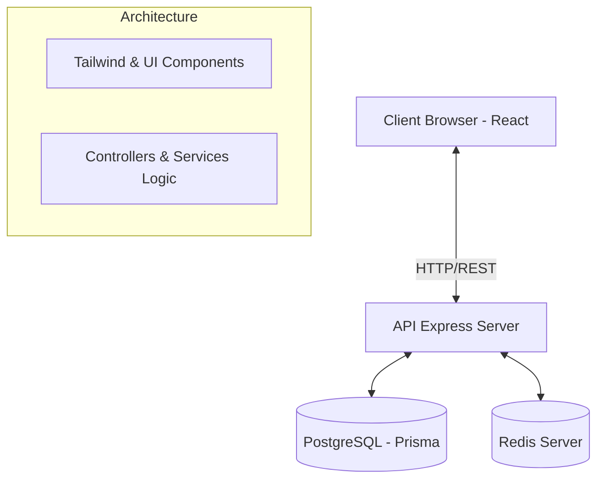
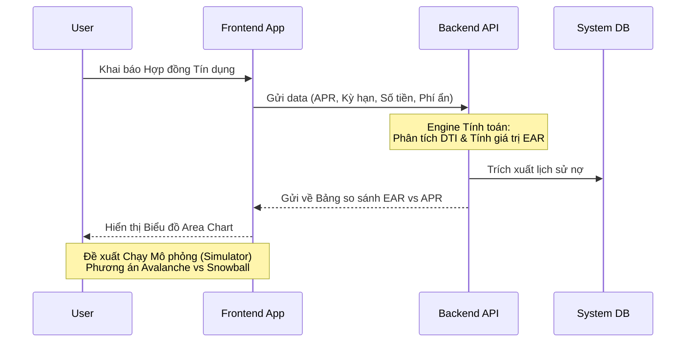

<div align="center">
  
  <h1>FINSIGHT — AI FINANCIAL ADVISOR</h1>
  <p><b>Giải pháp Quản lý Tài chính Chủ động & Cố vấn Đầu tư Thông minh</b></p>
</div>

> **Đề tài dự thi WebDev Adventure 2026 (WDA2026) — Chủ đề: Tài chính**

---

## 1. Tổng quan Dự án (Executive Summary)
**FinSight** là một nền tảng Web Application được thiết kế như một **"Cố vấn Tài chính Ảo"**. Ứng dụng tập trung xử lý hai nỗi đau lớn nhất (pain-points) của giới trẻ hiện nay: **Bẫy tín dụng tiêu dùng (Debt Trap)** và **Hội chứng Tê liệt Phân tích trong Đầu tư (Analysis Paralysis)**. 

Bằng cách áp dụng các mô hình tài chính thực tế và Dữ liệu Cảm xúc Thị trường (Market Sentiment), FinSight vạch trần các "chi phí ẩn" của nợ xấu, đồng thời tự động hóa lộ trình gỡ nợ và phân bổ tài sản an toàn chống tình trạng lạm phát. Dự án được lập trình 100% bằng code từ đầu (zero no-code tools), sở hữu UI/UX đậm chất SaaS chuyên nghiệp, đảm bảo sự mượt mà cho trải nghiệm Pitching/Demo.

---

## 2. Các Nền tảng Lý thuyết Tài chính (Financial Concepts)
Dự án không chỉ là một ứng dụng CRUD đơn thuần. Chúng tôi áp dụng trực tiếp các kiến thức Tài chính chuyên sâu làm Hệ tư tưởng (Core Engine) cho hệ thống:

- **EAR (Effective Annual Rate):** Khác với APR (danh nghĩa), EAR bóc trần sự thật về tác động của **Lãi kép (Compounding)** cùng các loại *Phí ẩn (Phí bảo hiểm, Phí làm hồ sơ)*. 
- **DTI Ratio (Tỷ lệ Dư nợ trên Thu nhập):** Công cụ đo lường sức khỏe dòng tiền. Đóng vai trò như "chỉ báo màu vàng/đỏ" cho khả năng thanh khoản của cá nhân.
- **Rủi ro Domino (Domino Effect):** Dạng khủng hoảng nợ dây chuyền (vay mới trả cũ) khi nhiều khoản tín dụng đáo hạn dồn dập.
- **Snowball & Avalanche Strategy:** Hai chiến lược tất toán nợ khoa học. *Snowball (Quả cầu tuyết)* đánh vào động lực tâm lý, *Avalanche (Tuyết lở)* chặn đứng sự bào mòn của lãi suất cao.
- **Market Sentiment (Fear & Greed Index):** Định hướng dòng tiền dựa trên tâm lý đám đông, phân bổ tài sản nghịch vòng chu kỳ để phòng vệ rủi ro.

---

## 3. Phân tích Module Nghiệp vụ (Core Modules)

### 📊 3.1. Module Quản Lý Nợ (Debt Management) - *Xóa bỏ "Bẫy Tín Dụng"*
Đây là module cốt lõi phân tích sức khỏe khoản vay của người dùng, mang lại cái nhìn minh bạch tuyệt đối về nợ gốc và lãi.
- **Tổng kết & Thống kê Dư nợ (Debt Dashboard):** Quản lý và trực quan hóa toàn bộ số dư nợ từ nhiều nguồn (Thẻ tín dụng, SPayLater, MoMo...). Đo lường sức túng quẫn qua **Chỉ số DTI**.
- **Phân tích Lãi suất thực tế (EAR X-Ray):** So sánh bằng đồ thị diện tích giữa APR và EAR, bóc tách toàn bộ **Chi phí ẩn** tạo ra vòng lặp nợ nần.
- **Chiến lược Trả nợ Tự động (Repayment Simulator):** Thuật toán mô phỏng chặng đường tất toán trong 3 năm tới bằng phương pháp **Avalanche** hoặc **Snowball** phụ thuộc vào "Extra Budget" cố định hàng tháng.
- **Hệ thống Cảnh báo Thông minh (Smart Alerts & Cron Jobs):** Gửi thông báo tự động khi nợ sắp đáo hạn. Mạng lưới phát hiện sớm trạng thái **Hiệu ứng Domino** (Nguy cơ vỡ nợ nếu có >= 2 khoản đáo hạn cùng tuần hoặc DTI > 50%).
- **Thêm khoản nợ qua AI (Advanced):** Tích hợp Chatbot AI và định dạng OCR hỗ trợ trích xuất ngay lập tức số liệu từ hóa đơn/hợp đồng vay mà không cần gõ phím.

### 📈 3.2. Module Cố vấn Đầu tư (Investment Advisor) - *Kiến tạo Dòng tiền*
Module đóng vai trò phân tích Vĩ mô và hướng dẫn người dùng "bỏ tiền vào quỹ nào".
- **Hồ sơ Rủi ro (Risk Assessment):** Hệ thống đánh giá khẩu vị rủi ro qua thu nhập, mục tiêu tài chính và điểm số bài Test, phân cấp người dùng (Hệ An toàn / Cân bằng / Mạo hiểm).
- **Trích xuất Cảm xúc Thị trường (Market Sentiment Tracker):** Lấy dữ liệu API thời gian thực để đo độ "Tham lam" hay "Sợ hãi" của thị trường.
- **Phân bổ Danh mục (Asset Allocation):** AI Rules Engine tự động gợi ý chia vốn % vào *Tiết kiệm, Vàng, Chứng khoán, Trái phiếu, Crypto*. (VD: Khi thị trường "Tham Lam Tột Độ" => Cảnh báo dịch chuyển % Crypto về Tiết kiệm - chốt lời an toàn).

### 🛠 3.3. Các Tính năng Toàn hệ thống
| Chức năng | Phân hệ | Tình trạng |
| :--- | :--- | :---: |
| **Authentication System** | Xác thực JWT bảo mật cường độ cao | `Hoàn tất` |
| **Unified Dashboard** | Tóm lược Net Worth và Báo cáo Tổng | `Hoàn tất` |
| **Theming (Dark/Light)** | CSS Variables linh hoạt chuẩn SaaS | `Hoàn tất` |
| **Responsive UI/UX** | Framer Motion cho trải nghiệm Flow mượt mà | `Hoàn tất` |

---

## 4. Công nghệ sử dụng (Tech Stack)
Dự án được triển khai bằng các giải pháp hiệu suất cao và chuẩn Công nghiệp:

❖ **Frontend:**


❖ **Backend:**


❖ **Database & DevOps:**


---

## 5. Sơ đồ Hệ thống (Architecture Diagrams)

### 5.1 Kiến trúc Client - Server


### 5.2 Luồng Logic Phân tích Nợ (Avalanche / EAR)


---

## 6. Khởi chạy & Triển khai Local (Setup Guide)

Yêu cầu máy tính cài sẵn Node.js (Phiên bản v18+) và PostgreSQL/Redis.

**Bước 1: Clone dự án**
```bash
git clone https://github.com/maaitlunghau/finance-webdev-adventure.git
cd finance-webdev-adventure
```

**Bước 2: Chạy API Server (Backend)**
```bash
cd server
npm install
npm run dev
# Server lắng nghe tại cổng http://localhost:5001
```

**Bước 3: Chạy Client (Frontend)**
*(Mở tab Terminal mới)*
```bash
cd client
npm install
npm run dev
# Dashboard mở tại http://localhost:5173
```

---

## 7. Tính Đổi mới & Định vị Sản phẩm
- **UX phi tập trung:** Không sử dụng các Template Bootstrap lỗi thời, FinSight đầu tư vào trải nghiệm tinh tế nhờ Design Tokens và Component Re-usability của hệ sinh thái React.
- **Chuyên môn Sâu sắc:** 100% logic thuật toán tài chính (EAR, DTI, Cảm xúc thị trường) được code thủ công, tạo ra "giá trị khai sáng" cho người dùng khi đối diện với các báo cáo số liệu khô khan truyền thống.
- **Sẵn sàng chinh chiến:** Luồng Flow UX đã khóa và tối ưu hoàn thành; tích hợp các chế độ *Demo* để trực quan hóa trong ngày Demo Day của cuộc thi. 
